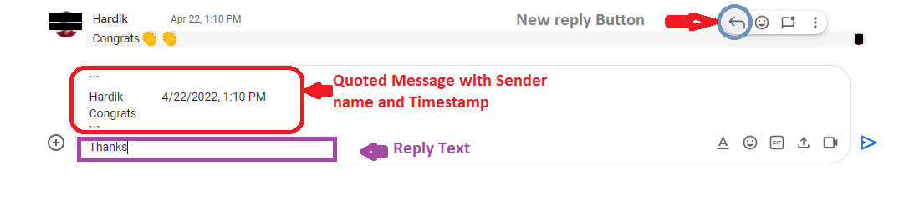

# GChat Message Reply Button

This will add a reply button to each message, which will appear on hovering the respective message along the other buttons.

On click of this `⤺ - reply button` a copy of message, Sender Name, DateTime will be added to messagebox with special quotes.
Below which you can type your reply and then this quoted text will look like a reply once sent.

- This script also handles multiple type of date parsing that Google shows ex. `Now` , `6 min` , `7:45 PM` , `Yesterday 7:36 PM` , `Wed 4:09 PM` , `Jun 17, 5:03 PM` and `May 10, 2021, 1:52 PM`.
All those DateTime types are parsed and  shows in the standard form like `6/24/2022, 7:36 PM`
- Also Handles Chat Spaces with multiple input boxes

# Sample

